# ShopNow DevOps Platform

A production-like DevOps platform built to simulate a real-world software delivery workflow using Kubernetes, Helm, GitLab CI/CD, Vault, Harbor, Prometheus, Grafana, ELK Stack, and SonarQube.

This project was designed as a personal hands-on lab to practice deploying, operating and troubleshooting a cloud-native microservices platform from source code to production.

---

# Overview

The platform demonstrates the complete DevOps lifecycle, including:

- Kubernetes-based microservices deployment
- Helm-based application deployment
- GitLab CI/CD automation
- Private container registry with Harbor
- Secrets management using HashiCorp Vault
- Code quality analysis using SonarQube
- Centralized monitoring with Prometheus & Grafana
- Centralized logging using ELK Stack
- NGINX Ingress and Kong API Gateway

# Architecture Overview

```text
                                      Internet
                                          │
                                   Cloudflare DNS
                                  (*.pma-server.site)
                                          │
                                          ▼
                         Ingress NGINX (Static Public IP)
                                          │
                                          ▼
┌────────────────────────────────────────────────────────────────────────────┐
│                 Kubernetes Cluster (3 Control Plane + Worker Nodes)        │
│                                                                            │
│  ┌──────────────────────────────────────────────────────────────────────┐  │
│  │                     ShopNow Microservices Platform                   │  │
│  │                                                                      │  │
│  │  Frontend                                                            │  │
│  │      │                                                               │  │
│  │      ▼                                                               │  │
│  │  API Gateway                                                         │  │
│  │      │                                                               │  │
│  │  ┌───┴───────────────┐                                               │  │
│  │  │                   │                                               │  │
│  │ Discovery        Product Service                                     │  │
│  │ User Service     Cart Service                                        │  │
│  │                   │                                                  │  │
│  │              PostgreSQL                                              │  │
│  └──────────────────────────────────────────────────────────────────────┘  │
│                                                                            │
│  Monitoring Stack             Logging Stack             CI/CD & Security   │
│  ────────────────             ─────────────             ────────────────   │
│  Prometheus                  Filebeat                   GitLab Runner      │
│  Grafana                     Logstash                   Vault              │
│  Alertmanager                Elasticsearch                                 │
│                               Kibana                                       │
│                                                                            │
└────────────────────────────────────────────────────────────────────────────┘
```

# CI/CD Process
```text
                      Developer
                          │
                      Git Push
                          │
                          ▼
                      GitLab
                          │
                          ▼
                      GitLab Runner
                          │
                          ├── Build Docker Image
                          ├── SonarQube Scan
                          ├── Push Image → Harbor
                          └── Deploy → Kubernetes
                                           │
                                           ▼
                                   ShopNow Platform

```

# Project screenshots

## GitLab

| Dashboard | Pipeline |
|-----------|----------|
| 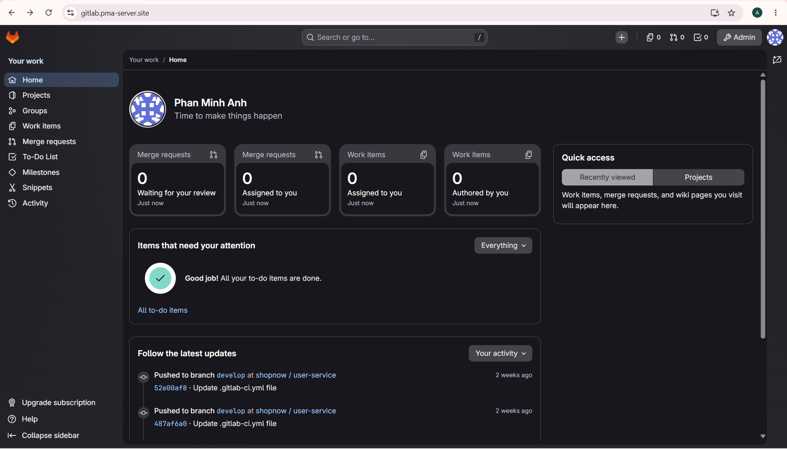 | 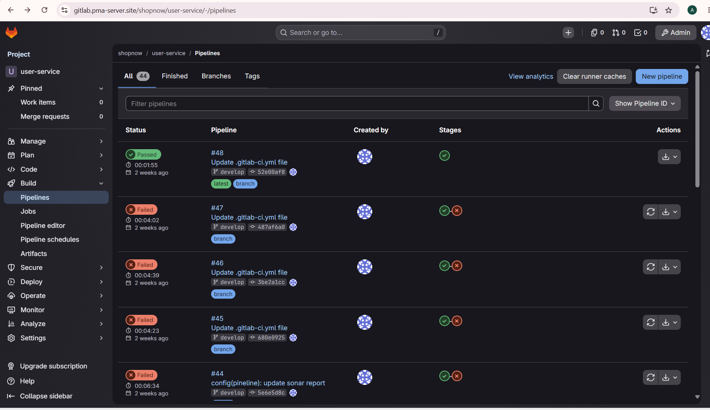 |

| Projects | Repository |
|----------|------------|
| 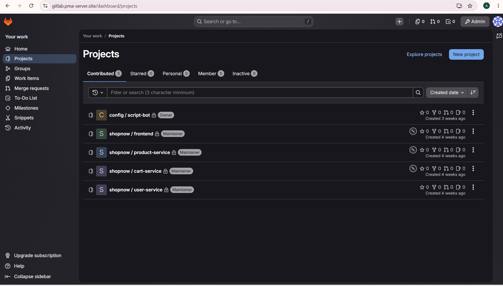 | 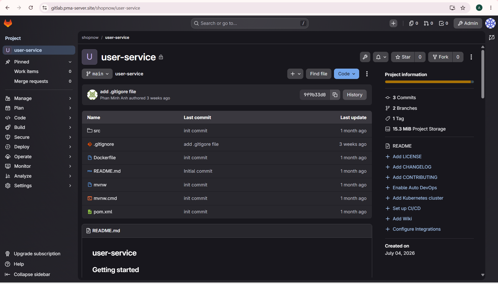 |

---

## Harbor

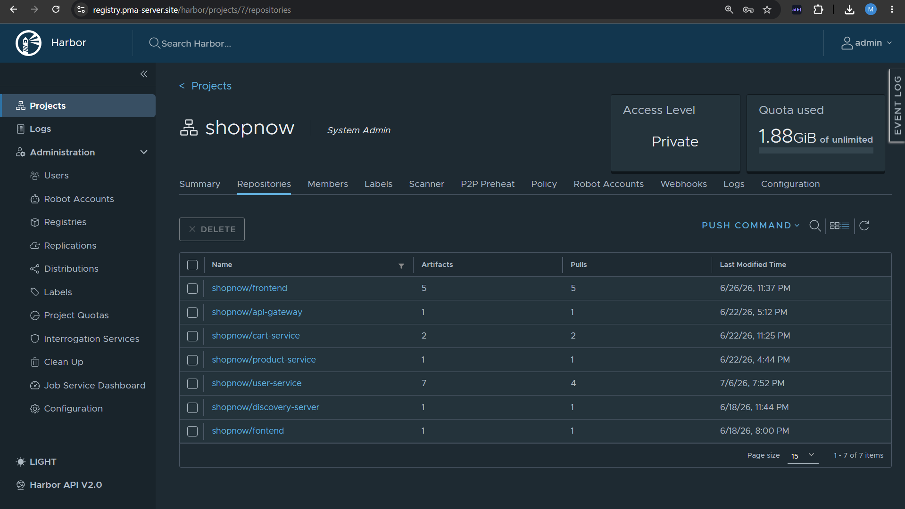

---

# Monitoring

| Grafana | Prometheus |
|---------|------------|
| 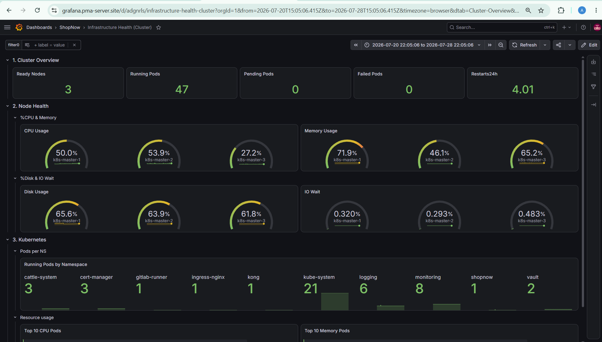 | 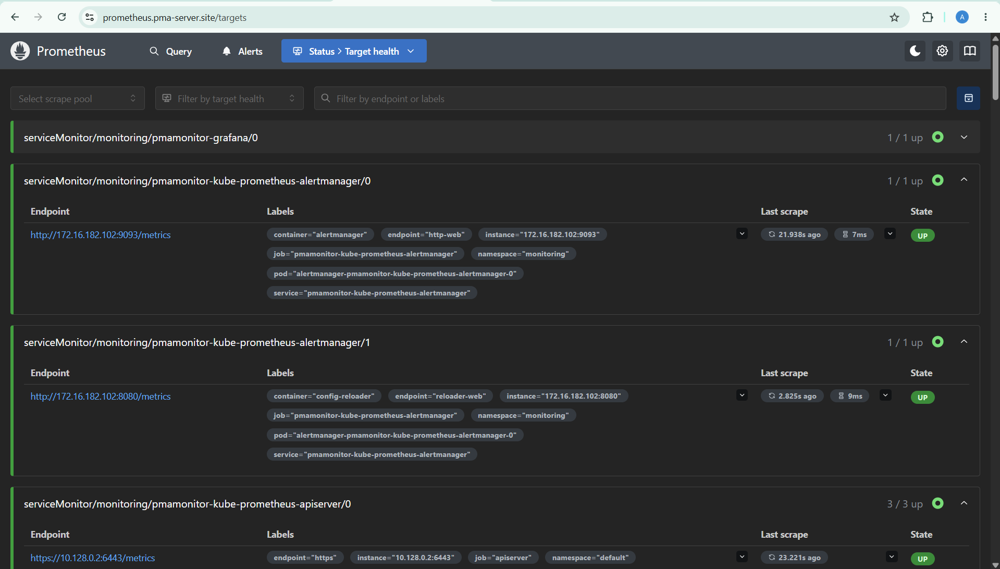 |

Prometheus Alerts

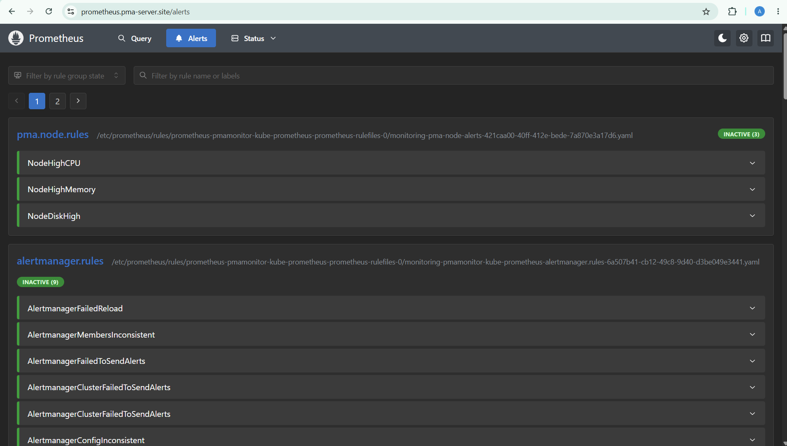

---

## Rancher

| Cluster | Workloads |
|---------|-----------|
| 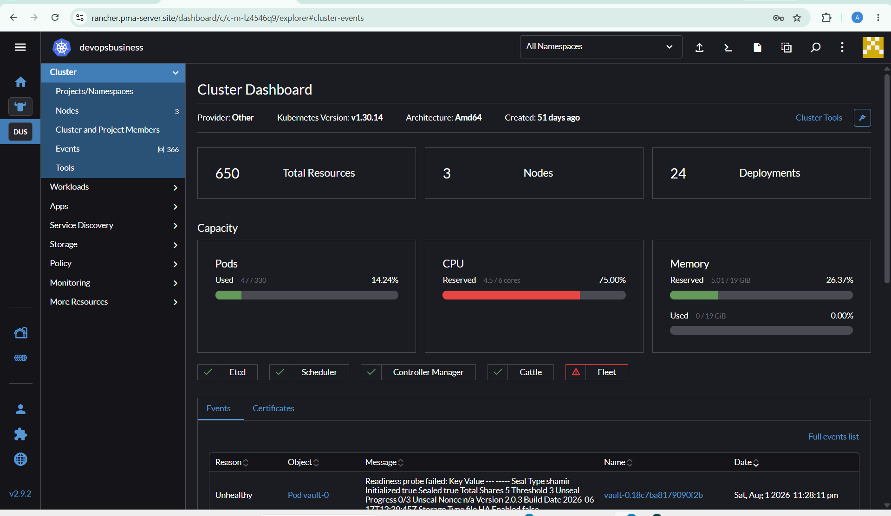 | 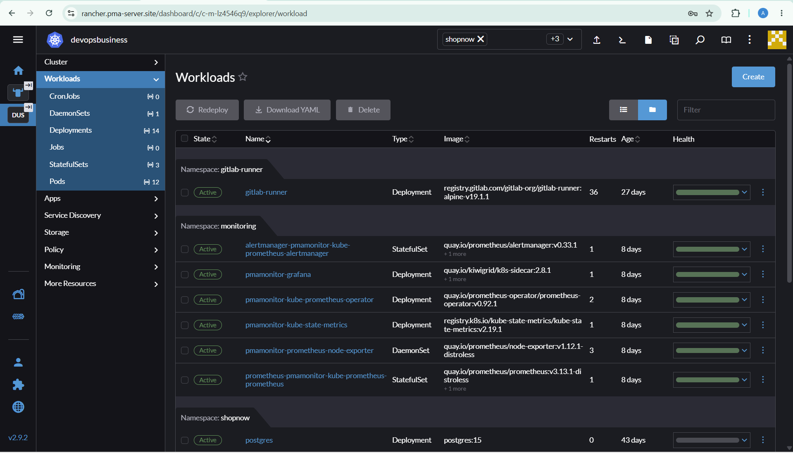 |

## Vault

| Secret KV | Policy |
|---------|-----------|
| 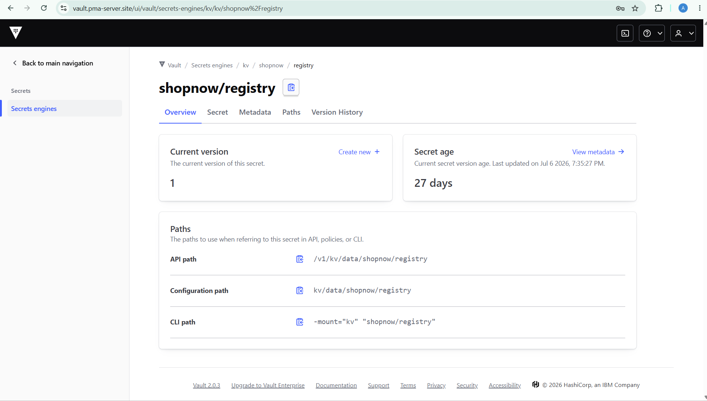 | 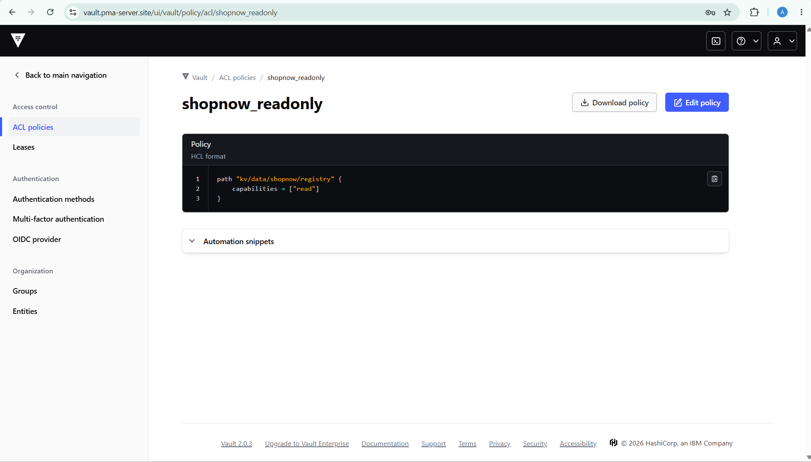 |

# Future Improvements

- Terraform provisioning
- ArgoCD GitOps deployment
- Horizontal Pod Autoscaler optimization
- Disaster Recovery documentation
- Multi-environment deployment
- Automated backup and restore
